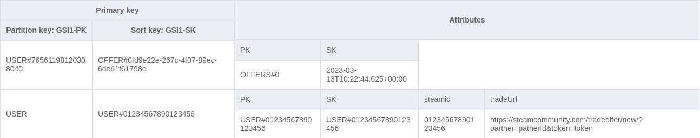
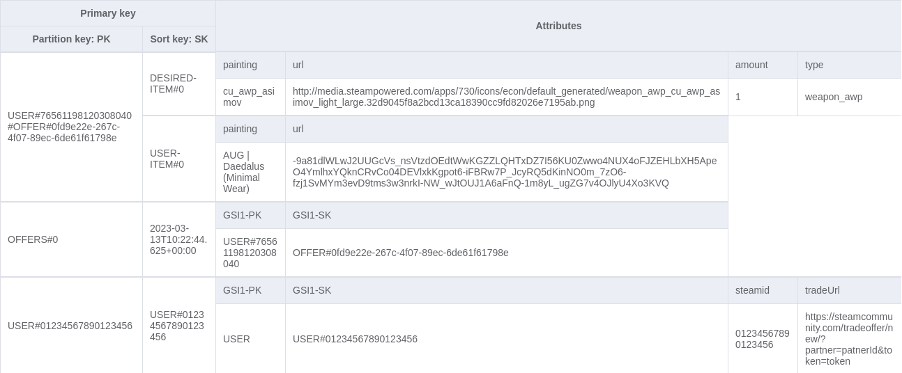

# CSGO Exchange

- [Getting Started](#getting-started)
  - [Setup](#setup)
  - [Deploy](#deploy)
- [Database schema](#database-schema)

## Getting Started

### Setup

CSGO Exchange is a serverless web application running on AWS. Its goal is to provide
a web interface allowing players to publish exchange requests visible to everyone.

In order to run the application, make sure to have the following installed:
  - [NodeJS >= v14.20.0](https://nodejs.org/en/download/)
  - [AWS CLI](https://docs.aws.amazon.com/en_en/cli/latest/userguide/getting-started-install.html)

### Deploy

In order to deploy, make sure you have the following `.env` at the root of the back folder:
```
REGION=aws_region
STACK_NAME=stack_name
DB_USERS=stack_name-users
HOSTNAME=your_hostname
JWT_SECRET=your_jwt_secret
STEAM_API_KEY=your_api_key
```

To deploy the backend on aws, run the following
```bash
$ cd back
$ yarn install
$ serverless deploy
```

Make sure to run the [refresh-db-script](./refresh-db-script/README.md) available at the root of the repository in order to populate the skins to the database.

Once the stack is deployed on aws you can run the client with the following `.env`:
```
REACT_APP_API_URL=api_url
JWT_SECRET=your_jwt_secret
HOSTNAME=your_hostname
```

```bash
$ cd front
$ yarn install
$ yarn start
```

## Database schema

The following represents the DynamoDB table schema of the project:

### Table


### GSI1

