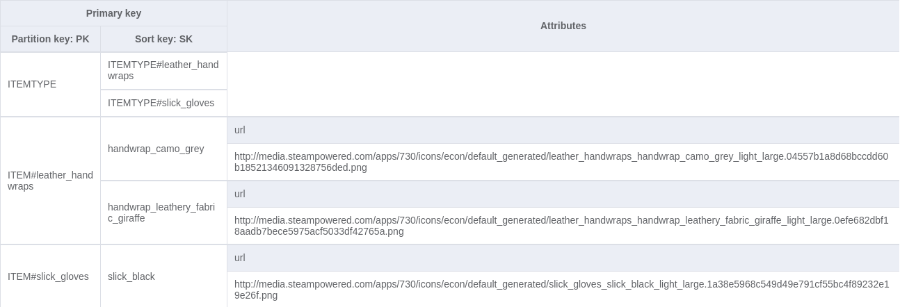

# Refresh-db-script

## About

This script aims to add to a DynamoDB table the items (weapons, gloves, knives) available in the file `items_game_cdn.txt` available [there](https://github.com/SteamDatabase/GameTracking-CSGO/blob/master/csgo/scripts/items/items_game_cdn.txt).

It contains a list of key-value pairs. The key is used to get a weapon type and painting, and the value for the icon url.

### Example:

`weapon_mac10_gs_mac10_snake=http://media.steampowered.com/apps/730/icons/econ/default_generated/weapon_mac10_gs_mac10_snake_light_large.0b91f21def06a39df43e93f6cd25cf13e4edfd19.png
`

In this case `weapon_mac10` will be used as the weapon type and `gs_mac10_snake` as the painting.

The following represents the DynamoDB table schema for the items.


## Usage

Before lauching the script, a `.env` file must be created at the root of this project with the `TABLE_NAME` and `REGION` environment variables.

Also, the csgoexchange stack **must** be deployed before launching this script.

In order to use this script, execute the following at the root of this project:
```shell
$ npm install
$ node src/index.js
```
